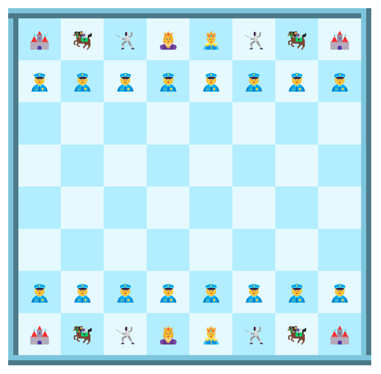

{: width="300px" height="300px"}

# Chess for Children

This is a ui chess project created using HTML and CSS only. It's a chess game designed for children, where traditional chess pieces have been replaced with gamified pieces.

## Project Overview

The project aims to provide an interactive and visually appealing chess experience for kids. The game utilizes HTML and CSS to create a user interface that resembles a chessboard and showcases unique and fun character designs for the chess pieces.

## Features

- Play chess on a colorful and engaging user interface.
- Gamified chess pieces with unique designs, including policemen as pawns.
- No functionality or game logic; it's a visual representation only.

## Technologies Used

- HTML5
- CSS3

## Contact

If you have any questions or suggestions, feel free to reach out. Thanks !